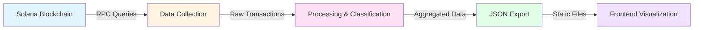
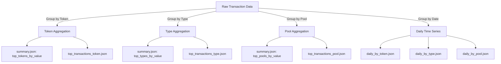
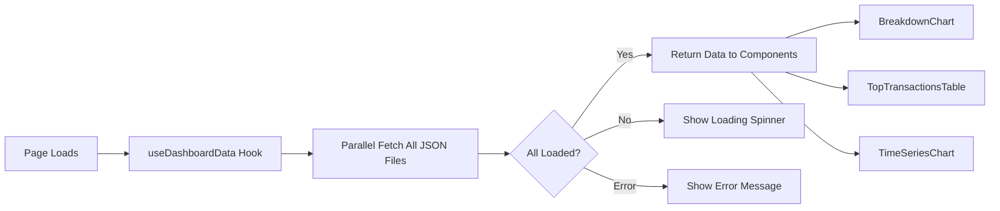
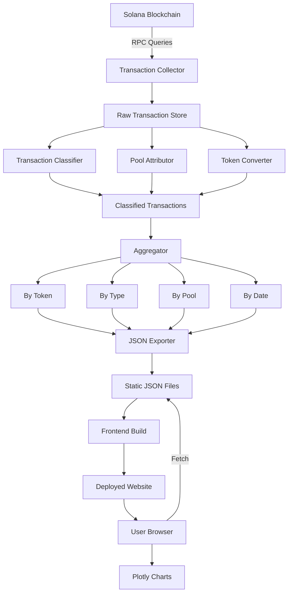
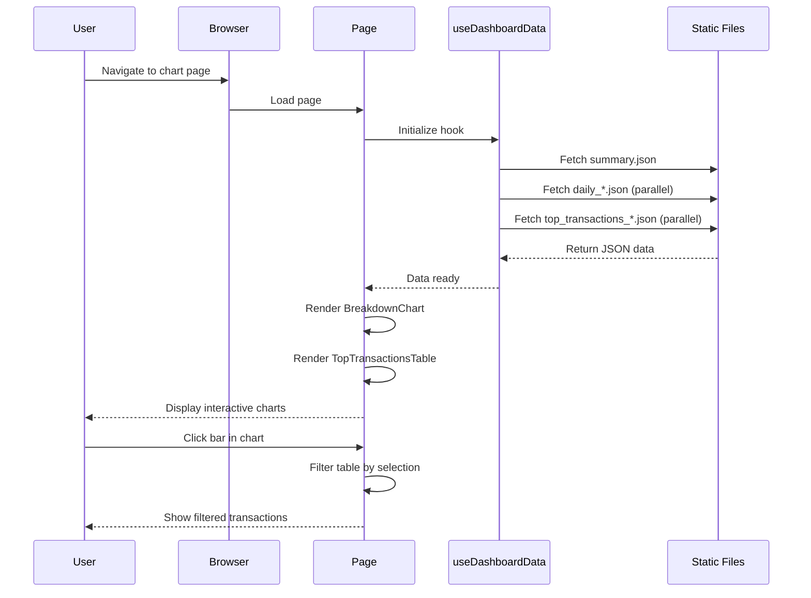
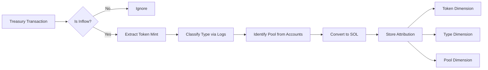

# Data Pipeline & Methodology

This page documents the complete data pipeline for karstenalytics, from blockchain data collection through to frontend visualization. Understanding this methodology helps you interpret the analytics accurately and understand how the data is processed.

## Overview

The karstenalytics data pipeline consists of five major stages:



Each stage is documented in detail below, with clear indicators for information coming from the backend (`solana_analytics` repository) versus frontend (`frontend` repository).

---

## Part I: General Data Infrastructure

### 1. Data Sources

**Primary RPC provider – Helius (paid mainnet endpoint)**  
- All fetching runs through `https://mainnet.helius-rpc.com/?api-key={API_KEY}` (configured in `solana_analytics/constants.py:8`).  
- We always request the enhanced JSON-RPC format so `logMessages`, `tokenTransfers`, `loadedAddresses`, and inner instructions are available for the classifier.

**Monitored on-chain accounts**  
- **Treasury PDA** `G9XfJoY81n8A9bZKaJFhJYomRrcvFkuJ22em2g8rZuCh` – every inflow is attributed back to this wallet.  
- **Associated Token Accounts (ATAs)** discovered via `getTokenAccountsByOwner`; cached in `cache/.../_verify_addrs.json` so each reload enumerates the same set.  
- **Program IDs** – DefiTuna staking program `tUnst2Y2sbmgSgARBpSBZhqPzpoy2iUsdCwb5ToYVJa`, Orca/Fusion DEX IDs, and any pool program IDs referenced in logs.  
- **Token mints** such as WSOL (`So111...112`) and TUNA; mint metadata is used for conversion and labeling.

**Secondary enumeration providers**  
- `full_cache_reload.py` auto-selects SolanaFM for today/yesterday ranges and Alchemy for older days, falling back to Helius if either provider errors. This keeps signature enumeration fast while preserving full historical coverage.

**Supplemental APIs**  
- DefiTuna pool metadata (`https://api.defituna.com/api/v1/pools`) and Helius token metadata endpoints to keep `pool_labels.json` and token info fresh.  
- Manual CSV + oracle prices for the APR tooling (`tools/compute_apy_data.py`) so APY charts can stitch historical and live data.  
- GoatCounter analytics script in the frontend (`frontend/docusaurus.config.ts:31-36`) for privacy-friendly usage telemetry.

**RPC methods & rate limiting**  
- Enumeration uses `getSignaturesForAddress` (seeded with previous day’s first signature) and `getTokenAccountsByOwner`.  
- Transaction fetches use batched `getTransaction` calls (batches of 50, fixed two-second delay between batches, three retries with respect for `Retry-After`).  
- Occasional `getAccountInfo`/`getProgramAccounts` lookups enrich unknown transactions during classification.  
- This setup processes ~1.5k transactions in 2–5 minutes and stays within the paid Helius quota.

### 2. Data Collection & Ingestion

`solana_analytics/full_cache_reload.py` is the single entry point for ingesting on-chain data. It is intentionally conservative—no mutable database, only deterministic files under `cache/`.

**Processing loop (per date):**
1. **Refresh monitored addresses** via `_refresh_verify_addrs` (PDA + ATAs) and write `_verify_addrs.json` so future runs use the same set.
2. **Enumerate signatures** with `_collect_signatures_for_day`, honoring `--pda-only` or `--include-atas`, seeding from the prior day’s first signature, and automatically choosing SolanaFM/Alchemy/Helius.
3. **Fetch transactions** in JSON-RPC batches (`_fetch_transactions_for_signatures`). Responses are filtered to the target UTC day and deduplicated.
4. **Classify & enrich** transactions through `_classify_transactions`, which performs a log-based pass, enriches “unknown” signatures with standard `getTransaction`, and produces a labeled record per signature.
5. **Persist raw cache** as `YYYY/MM/DD.jsonl.gz`. Files are sorted chronologically and end with a sentinel metadata row (`termin`, `count`, `first_sig`, etc.) that downstream scripts can validate against.
6. **Generate attribution** immediately after a successful write by invoking `_generate_realized_types_for_day`, which produces `.realized.json` (and optional `.ledger_state.json` if ledger persistence is enabled).

**Scope & cadence**
- We reload full historical ranges whenever attribution logic changes, and run incremental loads (typically daily) to append new days. `--resume` skips dates that already exist on disk.
- Because cache files live under versioned directories, regenerations simply overwrite the affected day after copying the previous file into `cache_backup/`.
- Any gaps (RPC errors, partial days) are surfaced as missing cache files; rerunning `full_cache_reload.py` for that date regenerates both raw and realized data deterministically.

**Metadata captured per transaction**
- Signature, timestamp (`timestamp` and `blockTime`), `tokenTransfers`, `nativeTransfers`, `logMessages`, `loadedAddresses`, fee payer, status, and the classifier output (`tx_type`, pool annotations, etc.). This rich record allows every downstream tool to work without calling RPC again.

### 3. Transaction Classification System

All labeling happens inside `solana_analytics/tx_classifier.py`. The current engine is 100 % log-based—no brittle instruction parsing or hard-coded account indexes.

**How it works**
1. The classifier receives the rich transaction object emitted during ingestion (logs, token transfers, account keys, loaded addresses, fee payer).  
2. `log_parser.classify_transaction_from_logs` extracts instruction names from `logMessages`. These names are normalized (lowercase, underscores removed) so variants such as `OpenPositionWithLiquidity` and `open_position_with_liquidity` resolve to the same key.  
3. The normalized name is looked up in the transaction type manager (`config/transaction_types.py`) which loads `config/transaction_types_config.json`. That file defines display names, revenue flags, cluster colors, and optional helpers like variant splitting.  
4. If multiple detectors could match, priority is resolved by configuration order and explicit `priority` values. If nothing matches, the transaction is tagged as `unknown` and later analysis highlights it.

**Configuration structure (excerpt)**
```json
{
  "CollectProtocolFees": {
    "display_name": "Collect Protocol Fees",
    "description": "Revenue from protocol fee collection",
    "include_in_revenue": true,
    "cluster": "Protocol fees",
    "color": "#2E86AB",
    "priority": 1
  },
  "StakingStake": {
    "display_name": "Staking Stake",
    "description": "User deposits that remain withdrawable",
    "include_in_revenue": false,
    "cluster": "Staking ops",
    "priority": 50
  }
}
```

**Maintenance & discovery**
- `tools/generate_realized_types.py` can optionally persist newly discovered types back into the config (under a gated flag) so analysts can audit them later.  
- Because the classifier relies on logs, adding a new type typically means capturing the new instruction name, assigning metadata in the config, and re-running `full_cache_reload.py` for affected days.  
- Unknown counts are printed during reloads (`classification breakdown`), making it obvious when the config lags behind on-chain behavior.

### 4. Pool Attribution Logic

Pool attribution lives in `solana_analytics/config/pools.py` and mirrors how analysts reason about the flows in the dashboard.

**Detection flow**
1. While processing each transaction, we inspect every account surface: `tokenTransfers.fromUserAccount/toUserAccount`, the main `accountKeys` array, and `loadedAddresses`.  
2. Any account that matches a known pool ID is captured immediately. If multiple pools appear (e.g., multi-hop operations), the classifier applies deterministic tie-breakers and falls back to `unknown_pool` if ambiguity remains.  
3. If no explicit match exists, we attempt a mint-based match: when a mint (or mint pair) uniquely maps to a pool in `pool_labels.json`, we attribute the transaction to that pool even if the program-derived vault never exposed its address in the transfer list.

**`pool_labels.json` structure (abridged)**
```json
{
  "overrides": {
    "Czfq3xZZDmsdGdUyrNLtRhGc47cXcZtLG4crryfu44zE": {
      "name": "Orca SOL-USDC Whirlpool",
      "protocol": "Orca Whirlpool",
      "aliases": [
        "EUuUbDcafPrmVTD5M6qoJAoyyNbihBhugADAxRMn5he9"
      ],
      "mints": [
        "So11111111111111111111111111111111111111112",
        "EPjFWdd5AufqSSqeM2qN1xzybapC8G4wEGGkZwyTDt1v"
      ]
    }
  },
  "auto_generated": { "...": { "name": "Fusion SOL-USDC", "protocol": "Fusion" } },
  "mint_overrides": {
    "EPjFWdd5AufqSSqeM2qN1xzybapC8G4wEGGkZwyTDt1v": [
      "Czfq3xZZDmsdGdUyrNLtRhGc47cXcZtLG4crryfu44zE"
    ]
  },
  "defaults": {
    "fusion": "Fusion pool {short}",
    "orca whirlpool": "Orca Whirlpool {short}",
    "default": "Pool {short}"
  }
}
```

**Label maintenance**
- `tools/refresh_pool_labels.py` scans the cache and latest `_last_run_realized.json`, merges in DefiTuna pool metadata, and writes new entries under `auto_generated`.  
- During every frontend export, `tools/precompute_site_data.py` refreshes pool labels first, then recomputes aggregations. That means newly discovered pools appear in charts as soon as the next export runs—no manual edits required unless we want to “pin” a nicer override label.

**Fallback behavior**
- If a transaction references a pool we have never seen, the system assigns `unknown_pool` so analysts can review it. We treat growing `unknown_pool` totals as a signal to add overrides or extend the heuristics.

### 5. Token Conversion & Normalization

The SOL normalization logic is embedded in `tools/generate_realized_types.py`. Every transaction runs through the same steps, which guarantees that the “By Token” and “By Type” charts reconcile perfectly.

**Pending-ledger model**
- Non-WSOL inflows (USDC, JUP, BONK, long-tail tokens) are recorded in a three-level ledger: `pending_ata_by_mint[mint][pool_id][tx_type] = amount`.  
- When a SwapReward/conversion transaction later swaps those tokens to WSOL, the script distributes the realized SOL back to the original ledger entries proportionally. This prevents double-counting (the swap itself is not revenue; the underlying inflows are).

**Price sources**
- Primary source: the conversion rate observed in the SwapReward transaction itself (WSOL received ÷ tokens spent). That is the definition of “same-day pricing”—we only trust swaps executed by the treasury and only on the day they occur.  
- Secondary source: if a mint is never swapped (e.g., airdropped tokens), `load_day_assets` + `load_global_price_cache` provides a WSOL- or USD-denominated price for that mint on that day. These caches are refreshed whenever new assets appear.  
- WSOL is treated as a 1:1 SOL equivalent, so direct WSOL inflows (`wsol_direct`) require no conversion.

**Fallback handling**
- If neither a swap nor a cached price exists, the amount stays in the ledger until a swap occurs. This is rare because ledger persistence carries balances across days via `*.ledger_state.json`.  
- The export clearly shows such pending balances (`pending_by_mint` fields) so analysts can spot days where tokens have not yet been realized.

**Auditability**
- Every `.realized.json` file contains both the mint-level totals (`realized_by_mint`) and the type-level totals (`realized_by_type`), along with any `pending_by_mint` residue. Recomputing SOL equivalents from these files will exactly match the charts served to the frontend.

### 6. Data Aggregation & Export

Aggregation is a two-step process:

1. **`treasury_analytics.py`** scans the realized files and builds `_last_run_realized.json`. This pass:  
   - Recomputes totals by mint/type/pool/day using streaming dictionaries (no pandas).  
   - Captures top transactions per mint, type, and pool during the same pass (heap-limited to keep only the largest entries).  
   - Optionally compares every day against the DefiTuna public API when `--debug-totals` is supplied.  
   - Stores diagnostic fields (`wsol_direct_total`, `largest_inflow_signature`, etc.) so we can inspect anomalies quickly.

2. **`tools/precompute_site_data.py`** converts `_last_run_realized.json` plus auxiliary caches (staker cache, usage metrics, APR data) into the JSON bundle consumed by the frontend. The script always refreshes pool labels first, then writes into `../frontend/static/data/`.

**Key outputs**
- `summary.json` – overall totals, date range, top tokens/pools/types, key metrics (30 d revenue, FDV, weekly wallets, etc.).  
- `daily_stacked.json` – stacked SOL per source (Orca, Fusion, Other) plus cumulative totals.  
- `daily_by_token.json` / `daily_by_type.json` / `daily_by_pool.json` / `daily_by_pool_type.json` – day-level time series sliced by the respective dimension.  
- `top_transactions_token.json` / `top_transactions_type.json` / `top_transactions_pool.json` / `top_transactions_pool_type.json` – for each dimension, the top transactions sorted by SOL, including signature, timestamp, pool label, token name, and type.  
- `pool_type_summary.json` – Marimekko-style cross-tab of pools vs transaction types, trimmed to keep the UI performant.  
- `usage_metrics.json`, `staking_tuna.json`, `staker_loyalty.json`, `wallet_revenue_attribution.json`, `pool_ramp_up.json`, `position_metrics.json`, `apy_data.json`, `key_metrics.json` – specialized datasets feeding the Usage, Staking, Wallet, and APR tabs.

**Manifest handling**  
`_manifest.json` (stored in `frontend/static/data/_manifest.json`) is updated manually after each export and records the ISO timestamp, treasury address, and date range published. The navbar reads this file to show “Last updated”.

**Validation**  
- Every export reuses the deterministic `.realized.json` files, so rerunning the pipeline produces byte-identical JSON (aside from timestamps).  
- `treasury_analytics.py --debug-totals` raises alerts when a day deviates from the DefiTuna API by >0.001 SOL.  
- If any JSON write fails, `precompute_site_data.py` stops with a non-zero exit so we never deploy partial bundles.

**Data Flow Diagram:**



---

## Part II: Frontend Data Architecture

*This section is fully documented from the frontend repository.*

### 1. Data Storage & Hosting

**Location:** All JSON data files are stored in `/static/data/` directory.

**Files:**
- `summary.json` - Summary statistics and top aggregations
- `daily_stacked.json` - Daily time series data
- `daily_by_token.json` - Daily breakdown by token
- `daily_by_type.json` - Daily breakdown by transaction type
- `daily_by_pool.json` - Daily breakdown by pool
- `top_transactions_token.json` - Top transactions grouped by token
- `top_transactions_type.json` - Top transactions grouped by type
- `top_transactions_pool.json` - Top transactions grouped by pool
- `top_transactions_pool_type.json` - Top transactions for pool-type combinations
- `pool_type_summary.json` - Summary for pool-type analysis
- `daily_by_pool_type.json` - Daily breakdown by pool-type combinations
- `_manifest.json` - Metadata with generation timestamp

**Hosting:** These files are served as static assets via Docusaurus. No backend API is needed - the frontend fetches JSON directly via HTTP.

**Update Process:**
1. Backend generates new JSON files
2. Files are copied to `frontend/static/data/`
3. `_manifest.json` is updated with current timestamp
4. Site is rebuilt and deployed
5. Frontend fetches fresh data on page load

### 2. Frontend Data Loading

**Hook:** `useDashboardData` (src/components/Dashboard/useDashboardData.ts:9-94)

**Architecture:**
```typescript
// Single hook manages all dashboard data
export function useDashboardData(): DashboardData {
  // Fetches all JSON files in parallel on component mount
  // Returns loading state, error state, and data
}
```

**Data Flow:**



**Loading Process:**
1. Hook initializes with `loading: true` state
2. Fetches all 11 JSON files in parallel using `Promise.all()`
3. Each file fetched from `/data/{filename}.json`
4. On success: Updates state with parsed data, sets `loading: false`
5. On error: Sets `error` message, sets `loading: false`
6. Components receive data and render

**Caching:** Browser caches JSON files. Cache is busted on deployment when file contents change.

### 3. Data Type Definitions

**File:** src/components/Dashboard/types.ts

**Key Types:**

```typescript
// Summary data structure
export interface SummaryData {
  date_range: {
    start: string;      // "YYYY-MM-DD"
    end: string;        // "YYYY-MM-DD"
    days: number;       // Number of days in range
  };
  totals: {
    wsol_direct: number;              // Direct WSOL amounts
    total_token_records: number;      // Count of token records
    total_pool_records: number;       // Count of pool records
    total_pool_type_records: number;  // Count of pool-type combinations
    total_type_records: number;       // Count of transaction types
    unique_mints: number;             // Number of unique tokens
    unique_pools: number;             // Number of unique pools
    unique_types: number;             // Number of transaction types
    unique_pool_type_pairs: number;   // Number of pool-type pairs
  };
  top_tokens_by_value: Array<{
    name: string;        // Human-readable token name
    mint: string;        // Token mint address
    total_sol: number;   // Total SOL equivalent
  }>;
  top_pools_by_value: Array<{
    pool_id: string;     // Pool address
    pool_label: string;  // Human-readable pool name
    total_sol: number;   // Total SOL equivalent
  }>;
  top_types_by_value: Array<{
    type: string;        // Display name
    types?: string[];    // Array of technical types (for filtering)
    label?: string;      // Same as type (consistency)
    total_sol: number;   // Total SOL equivalent
  }>;
}

// Individual transaction structure
export interface Transaction {
  signature: string;     // Solana transaction signature
  timestamp: number;     // Unix timestamp
  amount: number;        // SOL amount
  label: string;         // Human-readable label
  type: string;          // Transaction type classification
  mint: string;          // Token mint address
  token_name?: string;   // Readable token name
  pool_id: string;       // Pool address
  pool_label: string;    // Human-readable pool name
}

// Daily time series data point
export interface DailyDataPoint {
  date: string;          // "YYYY-MM-DD"
  daily_total: number;   // Total for the day
  [key: string]: string | number | undefined;  // Dynamic keys for categories
}
```

### 4. Chart Components

#### BreakdownChart Component

**File:** src/components/Dashboard/BreakdownChart.tsx

**Purpose:** Renders bar charts showing revenue breakdown by token/type/pool

**Props:**
```typescript
interface BreakdownChartProps {
  summary: SummaryData;          // Summary data to visualize
  groupMode: 'token' | 'type' | 'pool';  // Which dimension to group by
  onBarClick?: (id, label) => void;      // Callback for bar clicks
}
```

**Data Processing Logic:**

```typescript
// Based on groupMode, extract appropriate data from summary
switch (groupMode) {
  case 'token':
    labels = summary.top_tokens_by_value.map(t => t.name);
    values = summary.top_tokens_by_value.map(t => t.total_sol);
    ids = summary.top_tokens_by_value.map(t => t.mint);
    break;
  case 'type':
    labels = summary.top_types_by_value.map(t => t.label || t.type);
    values = summary.top_types_by_value.map(t => t.total_sol);
    ids = summary.top_types_by_value.map(t => t.types || [t.type]);
    break;
  case 'pool':
    labels = summary.top_pools_by_value.map(p => p.pool_label);
    values = summary.top_pools_by_value.map(p => p.total_sol);
    ids = summary.top_pools_by_value.map(p => p.pool_id);
    break;
}
```

**Label Formatting:**
- Pool labels: Swaps protocol and pair for better readability
  - "Orca (SOL-USDC)" becomes "SOL-USDC<br />Orca"
- Long labels: Automatically wrapped with `<br />` tags
- Labels rendered in Plotly with HTML support

**Interactivity:**
- Hover: Shows exact SOL amount and percentage
- Click: Triggers `onBarClick` callback with ID and label
- Theme: Automatically adapts to light/dark mode

**Color Scheme:**
- Accent color: `#00A3B4` (light mode) or `#4FD1C5` (dark mode)
- Borders: Dark background color between bars
- Uses `getPlotlyTemplate()` for consistent theming

#### TopTransactionsTable Component

**File:** src/components/Dashboard/TopTransactionsTable.tsx

**Purpose:** Shows individual transactions, optionally filtered by dimension

**Props:**
```typescript
interface TopTransactionsTableProps {
  topTransactionsToken: TopTransactionsData;   // By token
  topTransactionsType: TopTransactionsData;    // By type
  topTransactionsPool: TopTransactionsData;    // By pool
  groupMode: 'token' | 'type' | 'pool';
  selectedFilter: string | string[] | null;    // Current filter
  selectedFilterLabel: string | null;          // Label for display
  summary: SummaryData;
}
```

**Data Selection Logic:**
1. Choose appropriate `topTransactions` data based on `groupMode`
2. If `selectedFilter` is provided, show only matching transactions
3. Otherwise, aggregate all transactions and show top N
4. Sort by amount (descending)
5. Limit to configurable number (typically 10-20)

**Table Columns:**
- Signature (truncated, links to Solscan)
- Date/Time (formatted from Unix timestamp)
- Amount (SOL, formatted to 2 decimals)
- Label (human-readable description)
- Type (transaction classification)
- Token (token name or symbol)
- Pool (pool label)

**Filtering Behavior:**
- User clicks a bar in BreakdownChart
- `selectedFilter` receives the ID (mint/type array/pool_id)
- Table filters to show only transactions matching that ID
- "Clear Filter" button resets to show all top transactions

### 5. Page Structure

**Chart Pages:** Each breakdown page follows the same pattern:

```mdx
---
title: Revenue by [Token/Type/Pool]
---

# Revenue Breakdown: By [Dimension]

[BrowserOnly wrapper with embedded React component]
  - Uses useDashboardData() to fetch data
  - Renders BreakdownChart with appropriate groupMode
  - Renders TopTransactionsTable with filter state
  - Manages click interactions and filtering

# Documentation Content
- Overview of the visualization
- How to interpret the chart
- Key insights
- Interactive features
- Analysis tips
- Cross-references to other pages
- Methodology section (brief, links here)
```

**Example Pages:**
- `/docs/analysis/defituna/revenue-breakdown/by-token.mdx` (src/components/Dashboard/useDashboardData.ts:18)
- `/docs/analysis/defituna/revenue-breakdown/by-type.mdx`
- `/docs/analysis/defituna/revenue-breakdown/by-pool.mdx`

---

## Part III: Protocol-Specific Methodologies

### DefiTuna Treasury Analytics

#### Revenue Attribution System

Revenue attribution happens inside `tools/generate_realized_types.py`. The guiding rule is “count every inflow exactly once, classify it once, and attribute it simultaneously to a token, a transaction type, and a pool.”

**What counts as revenue?**
- Any increase in the treasury PDA or its ATAs that originates from protocol activity (fee collections, position adjustments, SwapReward conversions, etc.).  
- Staking operations, user deposits, authority changes, and internal bookkeeping transactions are explicitly marked `include_in_revenue: false` in `transaction_types_config.json`, so they show up in the cache but never in the SOL totals.

**Processing steps per transaction**
1. Load the raw transaction and classify it (Section 3).  
2. Identify whether tokens or native SOL moved **into** the treasury; ignore outflows.  
3. Attribute the mint to the token dimension immediately.  
4. Attribute the log-derived type (e.g., `fusion_collectprotocolfees`, `staking_swaprewardorca`).  
5. Resolve the pool via `identify_pool_for_transaction`. If no pool matches, default to `unknown_pool` so analysts can backfill later.  
6. Convert the amount to SOL using the SwapReward rate or the price cache (Section 5) and add it to `realized_by_mint`, `realized_by_type`, and `realized_by_pool` simultaneously.

Because every transaction produces a single token/type/pool triple, the frontend can pivot the same `.realized.json` data into any combination of charts without discrepancies. Ledger persistence (carrying token balances across days) ensures long-lived positions like “collect protocol fees over a month, swap once” still reconcile to 100 % of the treasury inflows.

#### Staking Analytics

Staking analytics pull directly from the same raw cache but focus on the staking program rather than treasury inflows.

**Identification**
- Any transaction whose classified type starts with `staking_` is treated as a staking event (stake, unstake, withdraw, claim, compound, swapreward helper).  
- Events are fed into `tools/build_staker_cache.py`, which produces a compact history of every wallet’s stake/unstake timeline.

**Aggregations**
- `tools/compute_tuna_staking_metrics.py` replays the cache to build `staking_tuna.json`. It tracks daily total balance, estimated staked vs unstaked split, deltas, and top net stakers/withdrawers over the past 7 days. When on-chain deltas cannot determine the exact split, the script fetches the latest total from `https://api.defituna.com/api/v1/staking/treasury` and re-normalizes history so charts stay aligned with reality.  
- `tools/compute_apy_data.py` uses the same data plus manual/oracle price inputs to produce “Reference APR” and “Your APR”, the two series rendered by `ApyChart`.

**Wallet-level insights**
- `tools/compute_staker_loyalty_metrics.py` combines the staker cache with reward amounts to measure behavior. Outputs include:  
  - Stake-size cohorts (mega >10 M TUNA, large 1‑10 M, medium 100k‑1 M, small &lt;100k).  
  - Compound vs claim counts and aggregate rewards per wallet.  
  - A scatter plot dataset for “compound rate vs stake size” used in the conviction chart.  
  - Weekly aggregates of claim vs compound volume.

These datasets feed the “Staked TUNA”, “Staker Conviction”, and “Wallet Timeline” pages in the frontend, enabling analysts to trace how staking health evolves over time.

#### Usage Statistics

Usage metrics are generated by `tools/compute_usage_metrics.py` and stored in `frontend/static/data/usage_metrics.json`.

- **User definition:** distinct signer addresses (fee payer + message signers) extracted from each classified transaction.  
- **Cohorts:**  
  - *Stakers* – signers involved in staking instructions (`staking_stake`, `staking_unstake`, `staking_withdraw`, `staking_claim_reward`).  
  - *Daily active users* – signers whose classified transaction names include verbs such as `collect`, `compound`, `open`, `liquidate`, `add`, `increase`, `decrease`, `close`, or `remove`, excluding `token_transfer` and `unknown`.  
- **Daily & weekly aggregation:** sets of addresses per UTC day feed `daily_counts`, and a 7‑day rolling window builds `weekly_users.rolling_counts`.  
- **Top wallets:** `_serialize_top_addresses` ranks wallets by `days_active`, `iso_weeks`, or total transactions so the frontend can display “Top addresses” tables.  
- **Bot handling:** there is no automated filter today—suspicious addresses can be removed manually before publishing—but the transparent JSON makes review straightforward.

**Related Pages:**
- Usage time series chart
- Weekly active wallets metric cards
- Top addresses tables

---

## Part IV: Data Quality & Validation

**Automated checks**
1. `comprehensive_realized_sol_check.py` recomputes WSOL inflows from the raw cache and compares them to the realized totals (tolerance ≤ 0.01 SOL).  
2. `scripts/compare_attribution_day.py YYYY-MM-DD` highlights any single-day gaps and prints the underlying transactions.  
3. `treasury_analytics.py --debug-totals` compares each day’s total against the DefiTuna API; divergences > 0.001 SOL halt the pipeline.  
4. Cache sentinels ensure `.jsonl.gz` files are complete—if the terminating metadata row is missing, downstream scripts refuse to read the file.  
5. Ledger persistence prevents “lost” SOL across days; `.ledger_state.json` files record every pending token balance.  
6. Frontend exports only run after all validations pass, ensuring charts always reconcile to 100 % of the treasury inflows.

**Known limitations & mitigations**
- New transaction types initially appear as `unknown` until the classifier is updated; reloads retroactively apply the fix.  
- If an entirely new pool appears, it is labeled `unknown_pool` until the next pool-label refresh.  
- `_manifest.json` is updated manually, so the “Last updated” timestamp reflects the human-approved export, not intermediate experiments.

**Front-end freshness**
- `useManifest` reads `/static/data/_manifest.json` and shows the latest `generated_at` timestamp in the navbar.  
- Because Docusaurus fingerprints static assets, pushing a new export automatically busts browser caches.

### Frontend Data Freshness

**Timestamp Display:** The frontend shows "Last updated" timestamp in the header, fetched from `/data/_manifest.json`:

```json
{
  "generated_at": "2025-01-15T12:34:56Z"
}
```

**File:** The timestamp is read by `useManifest` hook (src/hooks/useManifest.ts) and displayed in the navbar.

**Caching:** JSON files are cached by the browser. When new data is generated and the site is rebuilt, file hashes change and cache is automatically invalidated.

---

## Part V: Technical Reference

### Repository Structure

**Frontend Repository (this repo):**
```
frontend/
├── docs/
│   └── analysis/
│       ├── methodology.mdx          # This page
│       └── defituna/
│           ├── revenue-breakdown/
│           │   ├── by-token.mdx     # Token breakdown view
│           │   ├── by-type.mdx      # Type breakdown view
│           │   └── by-pool.mdx      # Pool breakdown view
│           └── [other analysis pages]
├── src/
│   ├── components/
│   │   └── Dashboard/
│   │       ├── useDashboardData.ts  # Data loading hook
│   │       ├── BreakdownChart.tsx   # Bar chart component
│   │       ├── TopTransactionsTable.tsx  # Transaction table
│   │       └── types.ts             # TypeScript type definitions
│   └── hooks/
│       └── useManifest.ts           # Manifest timestamp loader
└── static/
    └── data/                        # JSON data files (served as static assets)
        ├── summary.json
        ├── daily_*.json
        ├── top_transactions_*.json
        └── _manifest.json
```

**Backend Repository (solana_analytics):**

`
solana_analytics/
├── full_cache_reload.py            # Enumerate → fetch → classify → cache
├── treasury_analytics.py           # Aggregations + API cross-checks
├── tx_classifier.py                # Log-based classification engine
├── data_fetcher.py                 # Shared RPC helpers + price/cache loaders
├── tools/
│   ├── generate_realized_types.py  # Revenue attribution + ledger state
│   ├── precompute_site_data.py     # Builds frontend/static/data bundle
│   ├── compute_usage_metrics.py
│   ├── compute_tuna_staking_metrics.py
│   ├── compute_staker_loyalty_metrics.py
│   └── compute_apy_data.py
├── config/
│   ├── transaction_types_config.json
│   └── pool_labels.json
├── docs/ (methodology, revenue attribution, workflows)
└── cache/ (gitignored deterministic raw/reconciled files)
`
### Key Configuration Files

**`config/transaction_types_config.json`**  
- Defines every transaction label the classifier recognizes: display name, description, `include_in_revenue` flag, color/cluster, and priority.  
- Example entry shown in Section 3. Updating this file immediately affects the classifier; after editing we rerun `full_cache_reload.py` to apply the change across history.

**`config/pool_labels.json`**  
- Stores manual overrides, auto-generated labels, alias lists, and mint overrides for every known pool.  
- `tools/refresh_pool_labels.py` and `tools/precompute_site_data.py` keep the `auto_generated` section fresh; analysts only need to edit `overrides` when naming conventions should be fixed permanently.

**`constants.py`**  
- Centralizes RPC keys, treasury addresses, program IDs, and default cache paths. Frontend docs reference these values to avoid drift between repos.

**`tools/analysis/manual_tuna_prices.csv` (referenced by APR tooling)**  
- Houses historical TUNA price captures for periods where the oracle lacked data. `tools/compute_apy_data.py` merges this CSV with live oracle quotes.

### Data Update Workflow

1. **Reload or extend the cache** (manual command when new data is available or logic changed):  
   ```bash
   cd solana_analytics
   python full_cache_reload.py G9XfJoY81n8A9bZKaJFhJYomRrcvFkuJ22em2g8rZuCh \
     --start-date YYYY-MM-DD --end-date YYYY-MM-DD --cache-dir cache --verbose
   ```  
   Typical daily window (1–2 days) finishes in ~3–5 minutes including classification and realized-file generation.

2. **Regenerate aggregates and top transactions:**  
   ```bash
   python treasury_analytics.py --since 2025-07-24 --until 2025-11-07 \
     --cache-dir cache --debug-totals
   ```  
   This produces `_last_run_realized.json` and logs any deviation vs the DefiTuna API.

3. **Export frontend bundle:**  
   ```bash
   python tools/precompute_site_data.py G9XfJoY81n8A9bZKaJFhJYomRrcvFkuJ22em2g8rZuCh \
     --start-date 2025-07-24 --end-date 2025-11-07 \
     --cache-dir cache --out-dir ../frontend/static
   ```  
   Files land in `../frontend/static/data/*.json`. Running this command also refreshes pool labels and auxiliary datasets (usage, staking, APR, wallet attribution).

4. **Update `_manifest.json`:** manually write the new timestamp/date range in `frontend/static/data/_manifest.json` so the navbar reflects the publish time.

5. **Rebuild the site (user-triggered per CLAUDE.md):**  
   ```bash
   cd ../frontend
   npm run build
   npm run start   # optional local preview
   ```  
   Commit the changed JSON + manifest + any doc edits, then push to GitHub Pages (or run `npm run deploy` if desired).

6. **Monitoring:** GoatCounter provides page-level analytics, and the debug logs from steps 1–3 show any anomalies (unknown classifications, API mismatches, missing price data). There is no automated cron—runs are initiated manually to keep costs predictable.

---

## Appendix: Diagram Gallery

### Complete Data Pipeline

(Collector = `full_cache_reload.py`, Classifier = `tx_classifier.py`, Aggregator = `treasury_analytics.py`, Exporter = `tools/precompute_site_data.py`)



### Frontend Data Loading



### Revenue Attribution Flow

(Implementation inside `tools/generate_realized_types.py` – pending ATA ledger + SwapReward redistribution)



---

## Questions or Feedback?

This methodology documentation is continuously improved based on user feedback and pipeline updates.

**For questions about:**
- **Backend data collection & processing:** See solana_analytics repository
- **Frontend visualization & UX:** See frontend repository
- **Specific metrics or calculations:** Refer to the relevant section above

**To request updates:** Open an issue in the respective repository with questions or suggestions for improving this documentation.
