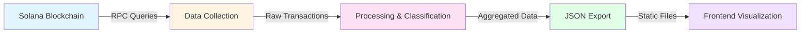
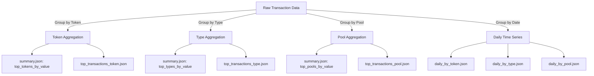
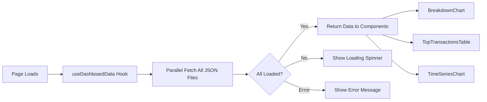
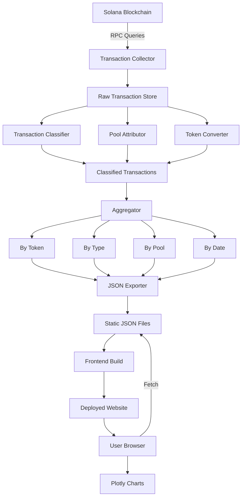
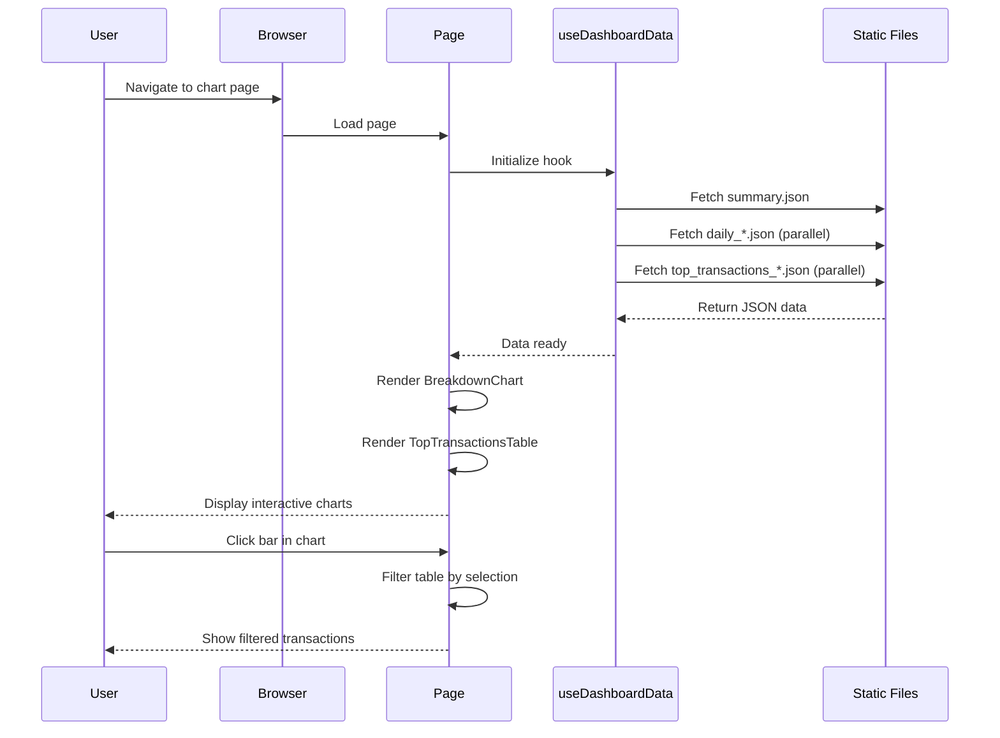
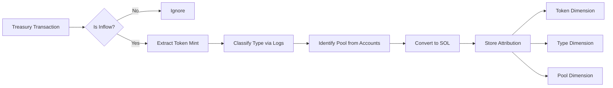

# Data Pipeline & Methodology

This page documents the complete data pipeline for karstenalytics, from blockchain data collection through to frontend visualization. Understanding this methodology helps you interpret the analytics accurately and understand how the data is processed.

## Overview

The karstenalytics data pipeline consists of five major stages:



Each stage is documented in detail below, with clear indicators for information coming from the backend (`solana_analytics` repository) versus frontend (`frontend` repository).

---

## Part I: General Data Infrastructure

### 1. Data Sources

**[BACKEND REQUIRED]**

*Instructions for backend documentation: Describe the following:*
- Which Solana RPC endpoints are used (mainnet, specific providers)
- Primary data sources (which blockchain accounts/programs are monitored)
- Any additional APIs or data sources beyond Solana RPC
- Whether you use multiple RPC providers for redundancy
- Rate limiting or API usage considerations

**Expected information:**
```
Example: "We query Solana mainnet via [provider name]. We monitor the following accounts:
- DefiTuna Treasury wallet: [address]
- DefiTuna Program ID: [address]
- Related pool accounts: [how identified]
RPC calls include: getTransaction, getSignaturesForAddress, getProgramAccounts, etc."
```

### 2. Data Collection & Ingestion

**[BACKEND REQUIRED]**

*Instructions for backend documentation: Explain the collection methodology:*
- What scripts/modules handle the initial data fetching?
- How are transactions identified as relevant (filtering logic)?
- What time range is collected (all historical data vs recent period)?
- How is data stored initially (database, files, in-memory)?
- Update frequency (real-time, hourly, daily, manual)?
- How do you handle gaps or missing data?
- What metadata is extracted from each transaction?

**Expected information:**
```
Example: "The collection process runs via [script name].py which:
1. Queries getSignaturesForAddress for the treasury wallet
2. Filters for [specific criteria]
3. Stores raw data in [storage method]
4. Runs [frequency] to capture new transactions
5. Handles blockchain reorganizations by [method]"
```

### 3. Transaction Classification System

**[BACKEND REQUIRED]**

*Instructions for backend documentation: Describe the classification engine:*
- How does the log-based analysis work?
- What is the structure of `transaction_types_config.json`? (provide example)
- How are patterns matched (regex, exact match, instruction parsing)?
- What attributes are used for classification (program IDs, instruction data, log messages)?
- How do you handle transactions that match multiple patterns?
- What happens with unclassified transactions?
- How is the classification config maintained/updated?

**Expected information:**
```
Example: "Classification uses tx_classifier.py which:
1. Parses transaction logs for key patterns
2. Matches against rules in transaction_types_config.json
3. Config structure:
   {
     "SwapReward": {
       "patterns": ["string to match"],
       "program_ids": ["..."],
       "priority": 1
     }
   }
4. Transactions are assigned to the highest priority matching type
5. Fallback category is 'Unknown'"
```

**Reference:** The by-type.mdx page mentions this system (lines 138-145) but needs technical details.

### 4. Pool Attribution Logic

**[BACKEND REQUIRED]**

*Instructions for backend documentation: Explain pool identification:*
- How are pool addresses extracted from transactions?
- What is the structure of `pool_labels.json`? (provide example)
- How do you identify which protocol a pool belongs to (Orca, Fusion, etc.)?
- What is the fallback logic for unlabeled pools?
- How are pool labels maintained and updated?
- Do you auto-generate labels for new pools?

**Expected information:**
```
Example: "Pool attribution process:
1. Extract pool account from transaction accounts array (position [X])
2. Look up address in pool_labels.json:
   {
     "pool_address": {
       "label": "SOL-USDC Orca Whirlpool",
       "protocol": "Orca",
       "pair": "SOL-USDC"
     }
   }
3. If not found, identify protocol from program ID
4. Generate temporary label like 'Orca Pool abc123...'
5. Manual review process adds proper labels"
```

**Reference:** The by-pool.mdx page outlines this (lines 137-143) but needs implementation details.

### 5. Token Conversion & Normalization

**[BACKEND REQUIRED]**

*Instructions for backend documentation: Explain SOL conversion methodology:*
- How are non-SOL tokens converted to SOL equivalents?
- Where do conversion rates come from (on-chain swaps, oracles, external APIs)?
- What does "same-day pricing" mean technically?
- How do you handle tokens without clear conversion rates?
- Is there a fallback rate source?
- How is WSOL handled (1:1 assumption)?

**Expected information:**
```
Example: "Token-to-SOL conversion:
1. Each token inflow includes timestamp
2. We extract actual swap rates from treasury's own swap transactions
3. For token X on day Y, we use the weighted average rate from all swaps that day
4. If no swap exists for that day, we [fallback method]
5. WSOL is counted 1:1 with SOL
6. Conversion rates are stored in [location] for auditability"
```

**Reference:** The by-token.mdx page has a basic explanation (lines 153-161) that can be expanded.

### 6. Data Aggregation & Export

**[BACKEND REQUIRED]**

*Instructions for backend documentation: Explain aggregation and JSON generation:*
- What scripts generate the final JSON files?
- How are aggregations calculated (SQL queries, pandas, custom logic)?
- What is the logic for "top N" selection (e.g., top tokens by value)?
- How are daily aggregations performed?
- What triggers the JSON export process?
- Where are JSON files written?
- How is data validated before export?

**List the key JSON files and their purposes:**
- `summary.json` - Contains what?
- `daily_stacked.json` - Contains what?
- `daily_by_token.json` - Contains what?
- `daily_by_type.json` - Contains what?
- `daily_by_pool.json` - Contains what?
- `top_transactions_token.json` - Contains what?
- `top_transactions_type.json` - Contains what?
- `top_transactions_pool.json` - Contains what?
- `top_transactions_pool_type.json` - Contains what?
- `pool_type_summary.json` - Contains what?
- `daily_by_pool_type.json` - Contains what?
- `_manifest.json` - Contains timestamp of data generation

**Expected information:**
```
Example: "JSON generation via [script name].py:
1. Reads processed data from [source]
2. Aggregates by dimensions:
   - By token: GROUP BY mint, SUM(sol_amount)
   - By type: GROUP BY transaction_type, SUM(sol_amount)
   - By pool: GROUP BY pool_id, SUM(sol_amount)
3. Top N selection: ORDER BY total_sol DESC LIMIT N
4. Daily aggregations: GROUP BY date, dimension
5. Writes JSON to output/ directory
6. Validation checks: [list checks]
7. Updates _manifest.json with generation timestamp"
```

**Data Flow Diagram:**



---

## Part II: Frontend Data Architecture

*This section is fully documented from the frontend repository.*

### 1. Data Storage & Hosting

**Location:** All JSON data files are stored in `/static/data/` directory.

**Files:**
- `summary.json` - Summary statistics and top aggregations
- `daily_stacked.json` - Daily time series data
- `daily_by_token.json` - Daily breakdown by token
- `daily_by_type.json` - Daily breakdown by transaction type
- `daily_by_pool.json` - Daily breakdown by pool
- `top_transactions_token.json` - Top transactions grouped by token
- `top_transactions_type.json` - Top transactions grouped by type
- `top_transactions_pool.json` - Top transactions grouped by pool
- `top_transactions_pool_type.json` - Top transactions for pool-type combinations
- `pool_type_summary.json` - Summary for pool-type analysis
- `daily_by_pool_type.json` - Daily breakdown by pool-type combinations
- `_manifest.json` - Metadata with generation timestamp

**Hosting:** These files are served as static assets via Docusaurus. No backend API is needed - the frontend fetches JSON directly via HTTP.

**Update Process:**
1. Backend generates new JSON files
2. Files are copied to `frontend/static/data/`
3. `_manifest.json` is updated with current timestamp
4. Site is rebuilt and deployed
5. Frontend fetches fresh data on page load

### 2. Frontend Data Loading

**Hook:** `useDashboardData` (src/components/Dashboard/useDashboardData.ts:9-94)

**Architecture:**
```typescript
// Single hook manages all dashboard data
export function useDashboardData(): DashboardData {
  // Fetches all JSON files in parallel on component mount
  // Returns loading state, error state, and data
}
```

**Data Flow:**



**Loading Process:**
1. Hook initializes with `loading: true` state
2. Fetches all 11 JSON files in parallel using `Promise.all()`
3. Each file fetched from `/data/{filename}.json`
4. On success: Updates state with parsed data, sets `loading: false`
5. On error: Sets `error` message, sets `loading: false`
6. Components receive data and render

**Caching:** Browser caches JSON files. Cache is busted on deployment when file contents change.

### 3. Data Type Definitions

**File:** src/components/Dashboard/types.ts

**Key Types:**

```typescript
// Summary data structure
export interface SummaryData {
  date_range: {
    start: string;      // "YYYY-MM-DD"
    end: string;        // "YYYY-MM-DD"
    days: number;       // Number of days in range
  };
  totals: {
    wsol_direct: number;              // Direct WSOL amounts
    total_token_records: number;      // Count of token records
    total_pool_records: number;       // Count of pool records
    total_pool_type_records: number;  // Count of pool-type combinations
    total_type_records: number;       // Count of transaction types
    unique_mints: number;             // Number of unique tokens
    unique_pools: number;             // Number of unique pools
    unique_types: number;             // Number of transaction types
    unique_pool_type_pairs: number;   // Number of pool-type pairs
  };
  top_tokens_by_value: Array<{
    name: string;        // Human-readable token name
    mint: string;        // Token mint address
    total_sol: number;   // Total SOL equivalent
  }>;
  top_pools_by_value: Array<{
    pool_id: string;     // Pool address
    pool_label: string;  // Human-readable pool name
    total_sol: number;   // Total SOL equivalent
  }>;
  top_types_by_value: Array<{
    type: string;        // Display name
    types?: string[];    // Array of technical types (for filtering)
    label?: string;      // Same as type (consistency)
    total_sol: number;   // Total SOL equivalent
  }>;
}

// Individual transaction structure
export interface Transaction {
  signature: string;     // Solana transaction signature
  timestamp: number;     // Unix timestamp
  amount: number;        // SOL amount
  label: string;         // Human-readable label
  type: string;          // Transaction type classification
  mint: string;          // Token mint address
  token_name?: string;   // Readable token name
  pool_id: string;       // Pool address
  pool_label: string;    // Human-readable pool name
}

// Daily time series data point
export interface DailyDataPoint {
  date: string;          // "YYYY-MM-DD"
  daily_total: number;   // Total for the day
  [key: string]: string | number | undefined;  // Dynamic keys for categories
}
```

### 4. Chart Components

#### BreakdownChart Component

**File:** src/components/Dashboard/BreakdownChart.tsx

**Purpose:** Renders bar charts showing revenue breakdown by token/type/pool

**Props:**
```typescript
interface BreakdownChartProps {
  summary: SummaryData;          // Summary data to visualize
  groupMode: 'token' | 'type' | 'pool';  // Which dimension to group by
  onBarClick?: (id, label) => void;      // Callback for bar clicks
}
```

**Data Processing Logic:**

```typescript
// Based on groupMode, extract appropriate data from summary
switch (groupMode) {
  case 'token':
    labels = summary.top_tokens_by_value.map(t => t.name);
    values = summary.top_tokens_by_value.map(t => t.total_sol);
    ids = summary.top_tokens_by_value.map(t => t.mint);
    break;
  case 'type':
    labels = summary.top_types_by_value.map(t => t.label || t.type);
    values = summary.top_types_by_value.map(t => t.total_sol);
    ids = summary.top_types_by_value.map(t => t.types || [t.type]);
    break;
  case 'pool':
    labels = summary.top_pools_by_value.map(p => p.pool_label);
    values = summary.top_pools_by_value.map(p => p.total_sol);
    ids = summary.top_pools_by_value.map(p => p.pool_id);
    break;
}
```

**Label Formatting:**
- Pool labels: Swaps protocol and pair for better readability
  - "Orca (SOL-USDC)" becomes "SOL-USDC<br>Orca"
- Long labels: Automatically wrapped with `<br>` tags
- Labels rendered in Plotly with HTML support

**Interactivity:**
- Hover: Shows exact SOL amount and percentage
- Click: Triggers `onBarClick` callback with ID and label
- Theme: Automatically adapts to light/dark mode

**Color Scheme:**
- Accent color: `#00A3B4` (light mode) or `#4FD1C5` (dark mode)
- Borders: Dark background color between bars
- Uses `getPlotlyTemplate()` for consistent theming

#### TopTransactionsTable Component

**File:** src/components/Dashboard/TopTransactionsTable.tsx

**Purpose:** Shows individual transactions, optionally filtered by dimension

**Props:**
```typescript
interface TopTransactionsTableProps {
  topTransactionsToken: TopTransactionsData;   // By token
  topTransactionsType: TopTransactionsData;    // By type
  topTransactionsPool: TopTransactionsData;    // By pool
  groupMode: 'token' | 'type' | 'pool';
  selectedFilter: string | string[] | null;    // Current filter
  selectedFilterLabel: string | null;          // Label for display
  summary: SummaryData;
}
```

**Data Selection Logic:**
1. Choose appropriate `topTransactions` data based on `groupMode`
2. If `selectedFilter` is provided, show only matching transactions
3. Otherwise, aggregate all transactions and show top N
4. Sort by amount (descending)
5. Limit to configurable number (typically 10-20)

**Table Columns:**
- Signature (truncated, links to Solscan)
- Date/Time (formatted from Unix timestamp)
- Amount (SOL, formatted to 2 decimals)
- Label (human-readable description)
- Type (transaction classification)
- Token (token name or symbol)
- Pool (pool label)

**Filtering Behavior:**
- User clicks a bar in BreakdownChart
- `selectedFilter` receives the ID (mint/type array/pool_id)
- Table filters to show only transactions matching that ID
- "Clear Filter" button resets to show all top transactions

### 5. Page Structure

**Chart Pages:** Each breakdown page follows the same pattern:

```mdx
---
title: Revenue by [Token/Type/Pool]
---

# Revenue Breakdown: By [Dimension]

[BrowserOnly wrapper with embedded React component]
  - Uses useDashboardData() to fetch data
  - Renders BreakdownChart with appropriate groupMode
  - Renders TopTransactionsTable with filter state
  - Manages click interactions and filtering

# Documentation Content
- Overview of the visualization
- How to interpret the chart
- Key insights
- Interactive features
- Analysis tips
- Cross-references to other pages
- Methodology section (brief, links here)
```

**Example Pages:**
- `/docs/analysis/defituna/revenue-breakdown/by-token.mdx` (src/components/Dashboard/useDashboardData.ts:18)
- `/docs/analysis/defituna/revenue-breakdown/by-type.mdx`
- `/docs/analysis/defituna/revenue-breakdown/by-pool.mdx`

---

## Part III: Protocol-Specific Methodologies

### DefiTuna Treasury Analytics

#### Revenue Attribution System

**[BACKEND REQUIRED]**

*Instructions for backend documentation: Explain the revenue attribution methodology:*
- How are "treasury inflows" defined? (all transfers to treasury wallet?)
- How do you distinguish revenue vs non-revenue transactions?
- What makes a transaction count as "revenue"?
- Are there any exclusions (internal transfers, etc.)?
- How is attribution by token/type/pool performed simultaneously?
- What happens if a transaction involves multiple tokens or pools?

**Expected information:**
```
Example: "Revenue attribution process:
1. Monitor treasury wallet address: [address]
2. Identify inflow transactions (increases in token balance)
3. Exclude: [list exclusions like internal transfers]
4. For each inflow:
   - Extract token mint (attribute to token dimension)
   - Classify transaction type via log analysis (attribute to type dimension)
   - Identify pool from transaction accounts (attribute to pool dimension)
   - Convert amount to SOL using conversion rates
5. Each transaction has one token, one type, one pool (or 'Unknown')
6. Store multi-dimensional attribution for flexible aggregation"
```

#### Staking Analytics

**[BACKEND REQUIRED]**

*Instructions for backend documentation: Explain staking data methodology:*
- How is staking activity identified on-chain?
- What defines a "staker" (any wallet that has staked)?
- How is staked amount calculated (snapshot vs cumulative)?
- APY calculation methodology
- Wallet classification approach (whale, regular user, etc.)
- Conviction scoring system (what is it? how calculated?)
- Time series aggregation for staking metrics

**Expected information:**
```
Example: "Staking analytics:
1. Monitor staking program: [program ID]
2. Track stake/unstake instructions
3. Maintain wallet state:
   - Current staked amount per wallet
   - Stake duration
   - Historical stake/unstake events
4. APY calculation: [formula]
5. Wallet classification:
   - Whale: > X TUNA staked
   - Regular: Y-X TUNA staked
   - Small: < Y TUNA staked
6. Conviction score: [explanation]"
```

**Related Pages:**
- Staked TUNA analysis
- Staker Conviction metrics
- Wallet Timeline view
- Staking APY calculations

#### Usage Statistics

**[BACKEND REQUIRED]**

*Instructions for backend documentation: Explain usage tracking:*
- How are "users" identified (wallets, sessions, other)?
- What activities count as "usage"?
- Daily/weekly aggregation logic
- User classification (new vs returning, active vs inactive)
- How do you handle bot/spam accounts?
- What metrics are tracked?

**Expected information:**
```
Example: "Usage statistics:
1. User = unique wallet address interacting with protocol
2. Activities tracked:
   - Swaps
   - Stakes/unstakes
   - Liquidity provisions
   - [other activities]
3. Daily aggregation: COUNT DISTINCT wallet_address per day
4. Weekly aggregation: COUNT DISTINCT wallet_address per week
5. User classification:
   - New user: first transaction in period
   - Returning: prior transaction > 7 days ago
   - Active: transaction in last 7 days
6. Bot filtering: [describe approach]"
```

**Related Pages:**
- Daily Users metrics
- Weekly active users
- User retention analysis

---

## Part IV: Data Quality & Validation

**[BACKEND REQUIRED]**

*Instructions for backend documentation: Explain quality assurance:*
- What validation checks run before data export?
- How do you verify 100% attribution (no missing SOL)?
- What are known data limitations or edge cases?
- How are errors or anomalies handled?
- What is the data update schedule?
- How is historical consistency maintained when logic changes?

**Expected information:**
```
Example: "Data validation:
1. Pre-export checks:
   - Sum of all attributions = total treasury inflow
   - No null values in required fields
   - All transactions have valid timestamps
   - Token conversion rates exist for all tokens
2. Attribution completeness:
   - Every transaction has exactly one type, one token, one pool
   - Totals across dimensions match overall total
3. Known limitations:
   - [list any known issues or edge cases]
4. Update schedule: [frequency]
5. Historical consistency:
   - When classification logic changes, historical data is reprocessed
   - Conversion rates remain fixed (no retroactive price updates)"
```

### Frontend Data Freshness

**Timestamp Display:** The frontend shows "Last updated" timestamp in the header, fetched from `/data/_manifest.json`:

```json
{
  "generated_at": "2025-01-15T12:34:56Z"
}
```

**File:** The timestamp is read by `useManifest` hook (src/hooks/useManifest.ts) and displayed in the navbar.

**Caching:** JSON files are cached by the browser. When new data is generated and the site is rebuilt, file hashes change and cache is automatically invalidated.

---

## Part V: Technical Reference

### Repository Structure

**Frontend Repository (this repo):**
```
frontend/
├── docs/
│   └── analysis/
│       ├── methodology.mdx          # This page
│       └── defituna/
│           ├── revenue-breakdown/
│           │   ├── by-token.mdx     # Token breakdown view
│           │   ├── by-type.mdx      # Type breakdown view
│           │   └── by-pool.mdx      # Pool breakdown view
│           └── [other analysis pages]
├── src/
│   ├── components/
│   │   └── Dashboard/
│   │       ├── useDashboardData.ts  # Data loading hook
│   │       ├── BreakdownChart.tsx   # Bar chart component
│   │       ├── TopTransactionsTable.tsx  # Transaction table
│   │       └── types.ts             # TypeScript type definitions
│   └── hooks/
│       └── useManifest.ts           # Manifest timestamp loader
└── static/
    └── data/                        # JSON data files (served as static assets)
        ├── summary.json
        ├── daily_*.json
        ├── top_transactions_*.json
        └── _manifest.json
```

**Backend Repository (solana_analytics):**

**[BACKEND REQUIRED]**

*Instructions: Provide the directory structure and key files:*
- Main entry points (scripts that run the pipeline)
- Data collection modules
- Classification engine files
- Aggregation/export scripts
- Configuration files
- Documentation

**Expected information:**
```
Example:
solana_analytics/
├── collectors/
│   └── transaction_collector.py    # Fetches blockchain data
├── processors/
│   ├── tx_classifier.py            # Classification engine
│   ├── revenue_attributor.py       # Revenue attribution logic
│   └── aggregator.py               # Data aggregation
├── exporters/
│   └── json_exporter.py            # Generates JSON files
├── config/
│   ├── transaction_types_config.json
│   └── pool_labels.json
└── [describe structure]
```

### Key Configuration Files

**[BACKEND REQUIRED]**

*Instructions: For each config file, provide:*
- File path
- Purpose
- Structure (example snippet)
- How it's maintained
- How to update

**Expected files:**
- `transaction_types_config.json` - Transaction classification rules
- `pool_labels.json` - Pool address to label mapping
- [Any other config files]

### Data Update Workflow

**[BACKEND REQUIRED]**

*Instructions: Document the end-to-end update process:*
1. How is data collection triggered? (manual, cron, CI/CD)
2. What commands are run?
3. How long does the process take?
4. Where are JSON files written?
5. How are they transferred to frontend repo?
6. How is the frontend rebuilt and deployed?
7. What monitoring/alerting exists?

**Expected information:**
```
Example:
1. Daily cron job at 00:00 UTC runs: python main.py --collect
2. Collection takes ~10 minutes
3. Processing runs: python main.py --process
4. Export runs: python main.py --export --output=./output/
5. JSON files copied to frontend/static/data/
6. _manifest.json updated with timestamp
7. Frontend CI/CD triggered via commit or manual deployment
8. Site rebuilds in ~5 minutes
9. New data visible to users
```

---

## Appendix: Diagram Gallery

### Complete Data Pipeline

**[BACKEND REQUIRED - Can be enhanced with specific script names]**



### Frontend Data Loading



### Revenue Attribution Flow

**[BACKEND REQUIRED - Add specific implementation details]**



---

## Questions or Feedback?

This methodology documentation is continuously improved based on user feedback and pipeline updates.

**For questions about:**
- **Backend data collection & processing:** See solana_analytics repository
- **Frontend visualization & UX:** See frontend repository
- **Specific metrics or calculations:** Refer to the relevant section above

**To request updates:** Open an issue in the respective repository with questions or suggestions for improving this documentation.
