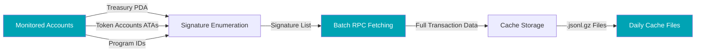
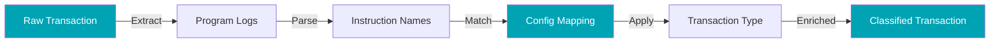
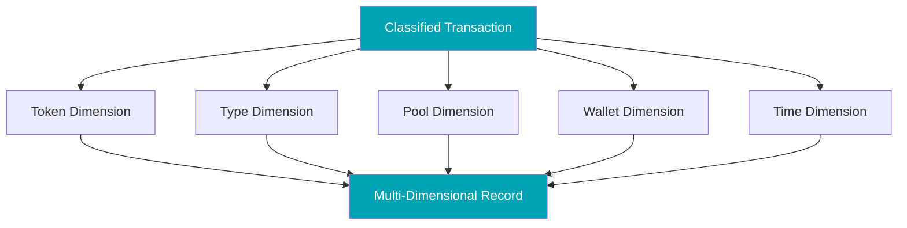
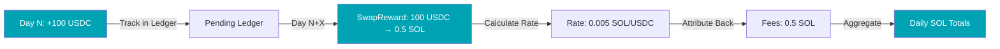
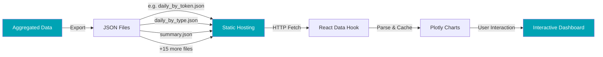

# End-to-end data pipeline

This page documents the general approach to analyzing Solana DeFi protocols through on-chain data.
For technology stack details, see [Technical Foundation](/intro/tech-setup). 

If you just want to see the numbers, feel free to skip this page.

## Overview

The data pipeline transforms raw blockchain transactions into interactive analytics through five major stages:

```mermaid
graph LR
    A[Solana Blockchain] -->|RPC Queries| B[Data Collection]
    B -->|Raw Transactions| C[Transaction Classification]
    C -->|Classified Data| D[Multi-Dimensional Attribution]
    D -->|Attributed Data| E[Token Normalization]
    E -->|Aggregated JSON| F[Frontend Presentation]

    style A fill:#00A3B4,color:#fff
    style B fill:#00A3B4,color:#fff
    style C fill:#00A3B4,color:#fff
    style D fill:#00A3B4,color:#fff
    style E fill:#00A3B4,color:#fff
    style F fill:#00A3B4,color:#fff
```

**Pipeline Overview:**

1. **Data Collection** - Enumerate transaction signatures for monitored accounts, fetch full transaction data with logs via Helius RPC, and store in compressed daily cache files
2. **Transaction Classification** - Parse program execution logs to identify what each transaction represents (fees, swaps, liquidations, etc.) and map to human-readable names using configuration files
3. **Multi-Dimensional Attribution** - Attribute each classified transaction across multiple dimensions simultaneously (token, transaction type, liquidity pool, wallet, time) enabling flexible analysis
4. **Token Normalization** - Track token accumulation in treasury accounts, apply same-day conversion rates from actual on-chain swaps, and attribute converted SOL back to originating transaction types
5. **Frontend Presentation** - Aggregate attributed data into dimension-specific JSON files, host as static assets, and render through interactive Plotly charts with filtering

**Processing Model:**

All processing happens offline in a separate backend repository. The frontend displays pre-computed results as static JSON files, ensuring fast load times regardless of data volume. This architecture enables complex multi-dimensional analysis while maintaining simple, reliable hosting.

Each section below includes a detailed diagram showing the internal flow for that pipeline stage.

---

## Data Collection

### What Gets Monitored

Analysis focuses on accounts relevant to understanding protocol operations:
- **Program accounts** - Smart contract interactions revealing protocol activity, e.g. Treasury accounts
- **Wallet addresses** - Key addresses involved in protocol operations
- **Token accounts** - Accounts holding protocol-relevant tokens (ATAs)

The specific accounts monitored depend on the analysis objective. Revenue analysis tracks treasury addresses. Staking analysis monitors staking program interactions. Position analysis follows liquidity pool accounts.

### Data Sources

**Primary:** Helius API provides enhanced transaction data with parsed logs and token transfers, guaranteeing logMessages and consistent classification.

**Supplemental:** Protocol websites and documentation provide context like token names and pool information.

On-chain transactions contain a lot of information. I try to get as much information as I can out of as little transactions as possible.

### Update Cadence

Data updates usually run daily via automated GitHub Actions workflow (.github/workflows/daily-data.yml), When analytical methods improve, the entire dataset is reprocessed to maintain uniform standards.

---

## Transaction Classification

Understanding what each transaction represents is fundamental to my analysis. Classification examines transaction logs to identify transaction purposes. **The core objective is identifying which Instruction is being executed** from the Program/Account we are observing.

### Log-Based Classification

**Solana programs themselves emit log messages during execution** as part of the blockchain's native logging system. These logs are not added by Helius, Solscan, or other data providers—they are produced directly by the on-chain programs and included in the transaction results returned by RPC nodes.

These logs contain instruction names describing operations. The classification system:
1. **Extracts instruction names** from the program logs
2. **Maps instruction names** to transaction categories based on a predefined configuration
3. ***Optional (protocol-specific)***: For certain analyses (e.g., staking loyalty) additional decoders parse Anchor IDLs to extract account-level context, but the core classification remains log-based for determinism

**Why Instructions Matter:** Instructions are the atomic operations in Solana programs. Understanding them is critical because:
- They reveal the exact purpose of each transaction (swap, stake, fee collection, etc.)
- Different protocols use different instruction names for similar operations
- IDL decoding provides structured information about parameters and accounts involved
- Accurate instruction identification enables precise revenue attribution and analytics

For example:
- A log containing "Instruction: CollectFees" represents collection of fees that have piled up in a certain market accouunt
- A log containing "Instruction: Stake" represents a staking operation
- IDL decoding reveals which accounts received fees or which pools were involved

### Classification Configuration

A configuration file maintains the mapping between instruction names and their meanings. This includes:
- Display names for user-facing labels (instead of technical strings)
- Categorization for grouping related transactions (there might be different instruction types we want to sum up and display as one type)
- Revenue flags indicating which transactions represent value generation. E.g. there are SwapReward transactions that convert tokens into SOL to distribute it to stakers. They are important but do not actually create the revenue
- Color schemes for consistent visualization (e.g. liquidations should always have a red-ish color)

When protocols introduce new transaction types, the configuration is updated and historical data is reprocessed for consistency.

---

## Multi-Dimensional Attribution

Transactions are attributed across multiple dimensions simultaneously, enabling flexible analysis from different perspectives.

### Attribution Dimensions

Common attribution dimensions include:
- **Token** - Which asset was involved (SOL, USDC, protocol tokens)
- **Transaction Type** - What operation occurred (fees, swaps, stakes)
- **Pool** - Which liquidity pool or program was involved
- **Wallet** - Which addresses participated
- **Time** - When the transaction occurred

Each transaction receives labels for all applicable dimensions, allowing the same data to power different analytical views.

### Pool Identification

**Pool identification works automatically** through a multi-source matching system. The system:

1. **Direct address matching** - Compares transaction account addresses against a registry of known pool addresses maintained in configuration files
2. **Alias resolution** - Maps alternative addresses (like position accounts or vault accounts) to their canonical pool IDs
3. **Token pair hints** - Uses mint addresses involved in transfers to identify pools when direct matches aren't found (e.g., a transaction involving SOL and USDC mints likely uses a SOL-USDC pool)
4. **Protocol detection** - Identifies the protocol (Orca, Fusion, etc.) from program IDs to generate fallback labels when pools aren't in the registry

The pool registry combines manually verified entries with auto-discovered pools. When a new pool is encountered, it's assigned a generated label (like "Orca pool abc1...def2") and can be promoted to the manual registry with a human-readable name. This hybrid approach ensures comprehensive coverage while maintaining accurate, user-friendly pool names.

---

## Token Normalization

To compare and aggregate transactions involving different tokens, values are normalized to a common denomination (typically SOL for Solana protocols).

### Conversion Approach

**On-chain rates:** When tokens are swapped, the actual exchange rate provides precise valuation for that moment. If we have multiple swaps per day, I use the multiple conversion rates to build an average daily price.

**Same-day pricing:** Conversion rates are applied only to transactions occurring on the same day, ensuring that historical values are never retroactively adjusted based on future price changes. See "Pending Conversions" below.

*Example:* If the treasury receives 100 USDC on Day 1 and swaps it for 0.5 SOL on Day 5, the Day 1 revenue is recorded as 100 USDC (unconverted). On Day 5, the swap reveals the rate (100 USDC = 0.5 SOL), and Day 5's attribution includes both the swap and the converted value. Day 1's historical record remains unchanged as 100 USDC, preserving the actual state of the treasury on that day. This prevents distortions where today's prices misrepresent historical revenue.

**Native token handling:** Wrapped versions of native tokens (like WSOL) convert 1:1 with their native counterparts.

### Pending Conversions

**Context:** This is particularly relevant for **treasury accounts** in DeFi protocols. Treasuries often accumulate diverse tokens (fee revenue in USDC, BONK, various LP tokens, etc.), but **only a specific token is made available for distribution to stakers** (typically the protocol's native token, USDC or SOL).

For example, a treasury might receive:
- 100 USDC from swap fees
- 500,000 BONK from a liquidation
- 0,01 cbBTC from opening an LP position

But the protocol only distributes SOL to stakers. Until the treasury swaps these tokens for SOL, they remain "pending conversions."

**Accounting Treatment:** Tokens not yet converted remain tracked in their native denomination but excluded from SOL-normalized totals until conversion occurs on-chain. This ensures reported values reflect **realized amounts** (actual conversions that happened) rather than estimates based on external price feeds. When the treasury eventually swaps 100 USDC for 0.5 SOL, that 0.5 SOL is recorded as revenue on the day of the swap, not on the day the USDC was originally received.

---

## Frontend Presentation

Processed data exports as JSON files served as static assets. The frontend loads these files and renders interactive visualizations using Plotly charts.

### Data Export

The backend aggregates attributed and normalized data into dimension-specific JSON files. Examples include:
- `daily_by_token.json` - Revenue by token mint per day
- `daily_by_type.json` - Revenue by transaction type per day
- `daily_by_pool.json` - Revenue by liquidity pool per day

In total, the system exports ~20 JSON files covering daily time series (by token, type, pool, pool-type combinations), summary statistics, top transaction rankings, staking metrics (`staking_tuna.json`, `staker_loyalty.json`), usage statistics, APR data, and more.

### Static Architecture

All JSON files are hosted in the `/static/data/` directory and served as immutable assets. This approach:
- **Ensures fast load times** - No server-side processing or database queries
- **Enables simple hosting** - Works with any static file server or CDN
- **Supports offline analysis** - Complete dataset is downloadable
- **Maintains consistency** - All users see the same pre-computed data

### Frontend Loading

The React frontend uses a custom hook (`useDashboardData`) to:
1. Fetch all JSON files in parallel on page load
2. Parse and validate the data structure
3. Cache results in React state
4. Provide loading states and error handling

### Interactive Visualization

Plotly charts consume the loaded data and enable:
- **Multi-dimensional filtering** - Click any bar/segment to filter other views
- **Cross-chart interaction** - Selection in one chart updates all related charts
- **Responsive design** - Charts adapt to screen size and theme (light/dark mode)
- **Export capabilities** - Download charts as PNG or view underlying data

A manifest timestamp (displayed in the site header) indicates when data was last updated, helping users understand data freshness.

---

## Data Quality

Data quality is paramount for accurate on-chain analytics. The pipeline maintains rigorous standards including 100% attribution accuracy, automated validation during processing, and manual verification tools for deep auditing.

**For detailed information on quality standards, automated checks, and verification tools, see: [Data Quality](./data-quality)**

---

*This represents the general analytical framework. Protocol-specific methodology pages document particular implementations and unique challenges.*
